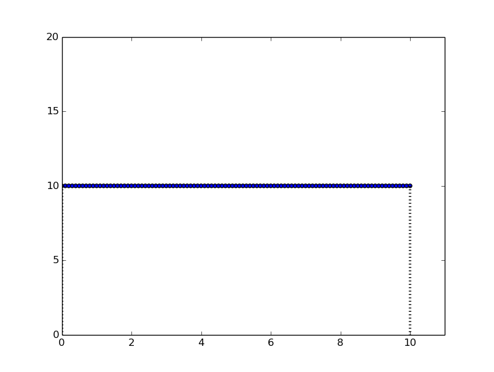

Recently, a discussion with a friend made me realize that a lot of students are
taught calculus as a bunch of formulae and not as a useful concept to understand
several phenomena in the universe. To show the beauty of calculus, I decided to
write a small tutorial explaining the basic concepts of limits, differentiation
and integration. Immediately connecting these concepts, I will also show how
basic motion laws in physics can be interpreted.

## Slope, Limits, Differentiation & Integration

We will be using one and only one curve the whole tutorial, it will change its
purpose and meaning as we go by. But the curve will remain the same and between
the exact same points `P1 = (x1,y1)` and `P2 = (x2,y2)`.

[Release]: # 
{:height="400px"}

**Figure 1: The one curve that will help us all.**

When we *graph* something, we are always showing a *relation* between the variables
plotted on the different axes. In effect, we can say that `y = f(x)`, where `f`
is some functions. Some of the examples could be:

> $$ f(x) = 3x + 15x^2 $$

Anyways, we all know that two points form a straight line and the slope of the
line (or inclination) is given by $$ \frac{y2 - y1}{x2 - x1} $$. This is simple!
Plotting this line along with the curve looks this way. 

[Release]: # 
{:height="400px"}

**Figure 2: If we pay attention to the line, we can see that $$ dx = (x2-x1) $$, with $$ dx = 10 $$**

Instead of one line, if I put a point (P3) in the middle of the curve and plot two
lines, they will have different slopes. The lines along with the plot look this
way.

[Release]: # 
{:height="400px"}

**Figure 2: Putting a point in the middle makes it two lines and $$ dx = 5 $$**

We make them three, we make them four and on and on. As we increase the number
of points (essentially increasing the number of line) between x1 and x2, we
decrease the distance between two adjacent intermediate points. This is what the concept 
of `limit` really is. In our case, we reduce the `dx` to almost 0. If we write down the 
slope with this concept along with putting ($$ y = f(x) $$ and $$ x2 = x1 + dx $$), we get the following:

> $$ \lim_{dx\to0} \frac{f(x+dx) - f(x)}{dx} $$

> Differentiation is pretty much finding the slope of a curve at a point!

At one time in the past, the biggest scientists in europe made a fuss about how to write this and the modern
 notation is commonly written as `$$ \frac{dy}{dx} $$`.

All this sounds cool! But then what is `integration` exactly? We will take a U-turn from here. Let us take a plot again,
 this time a simple straight line with one constant value
- which happens to be the slope that we measured in figure 1. So, if we want the area under this curve, it is simply the area of the rectangle that will give us one `value`.

[Release]: # 
{:height="400px"}

**Figure 4: A single line that forms a rectangle with $$ dx = 10 $$**

So, if we take the slopes of the 2 lines in figure 2 and plot them, they will look like the following image. The areas of these two rectangles will be two `values`. 

[Release]: # 
{:height="400px"}

**Figure 5: The two lines that form two rectangles with $$ dx = 5 $$**

Let us do the same thing again, let us take the dx all the way to 0, then we get a teeny-tiny wide rectangle that looks like the following:

[Release]: # 
{:height="400px"}

**Figure 6: A small rectangle with $$ dx\to0 $$**

This area of this teeny-tiny rectangle is what is typically the `value of the integral` at that point x. And if we put all those values together, 
 we get the `indefinite integral` that is often written with capital letter of the function - F(x). So, if we write that down :

> $$ F(x) = \int{f(x)dx} $$

That is it! Now, let us see how these concepts help us in physical world. Let us take a random planet with g=2 and no atmosphere. If we drop a ball from some height and 
see the change in height as a function of time elapsed. The dropping ball looks the following way.

## A Dropping ball

<button onclick="myFall()">Animate the ball</button>

 

<button onclick="myMove()">Animate the ball</button>

